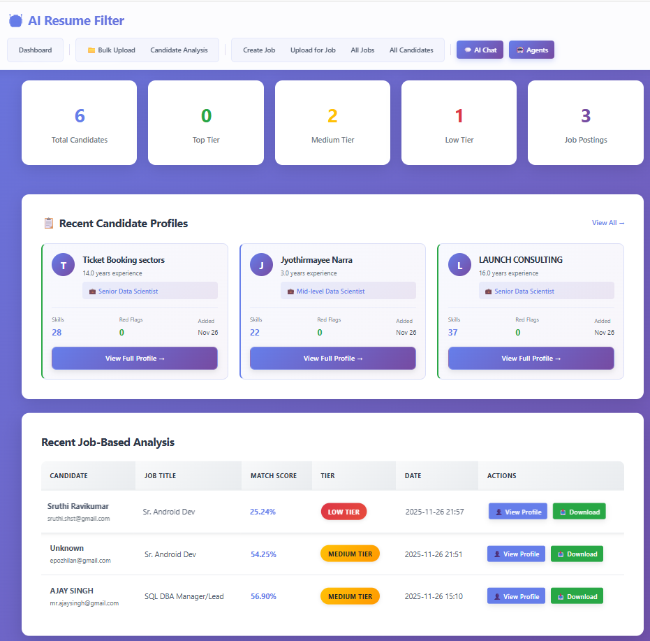
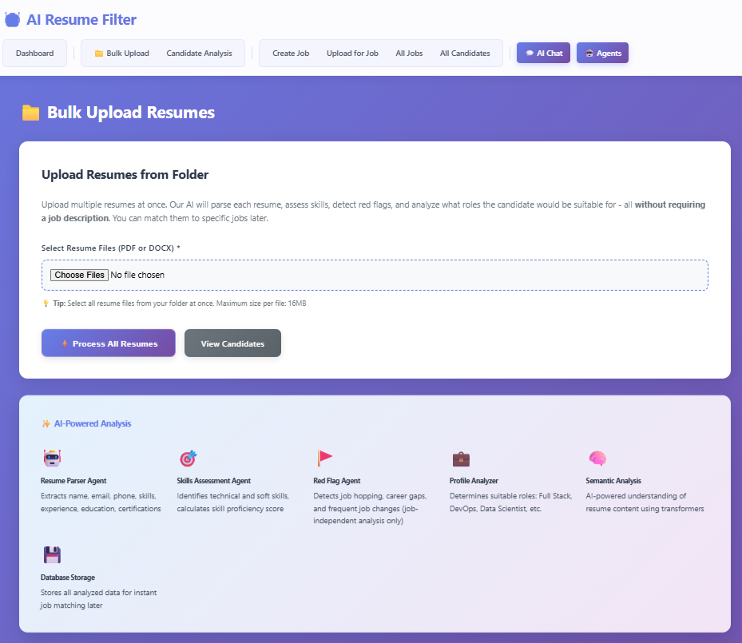
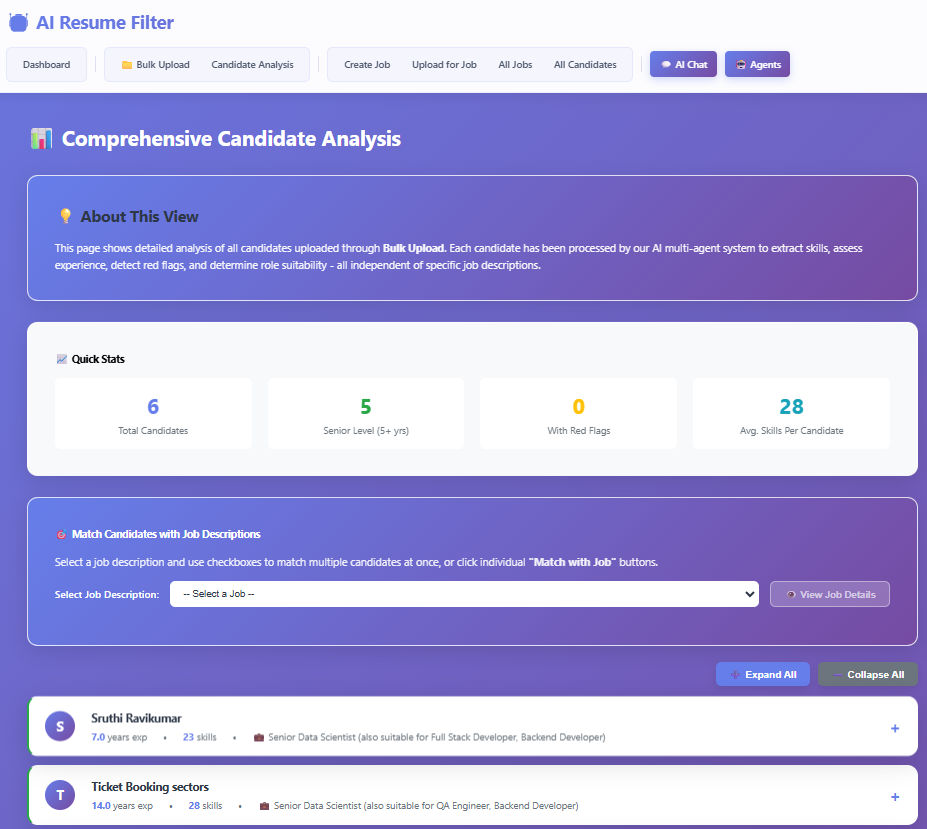
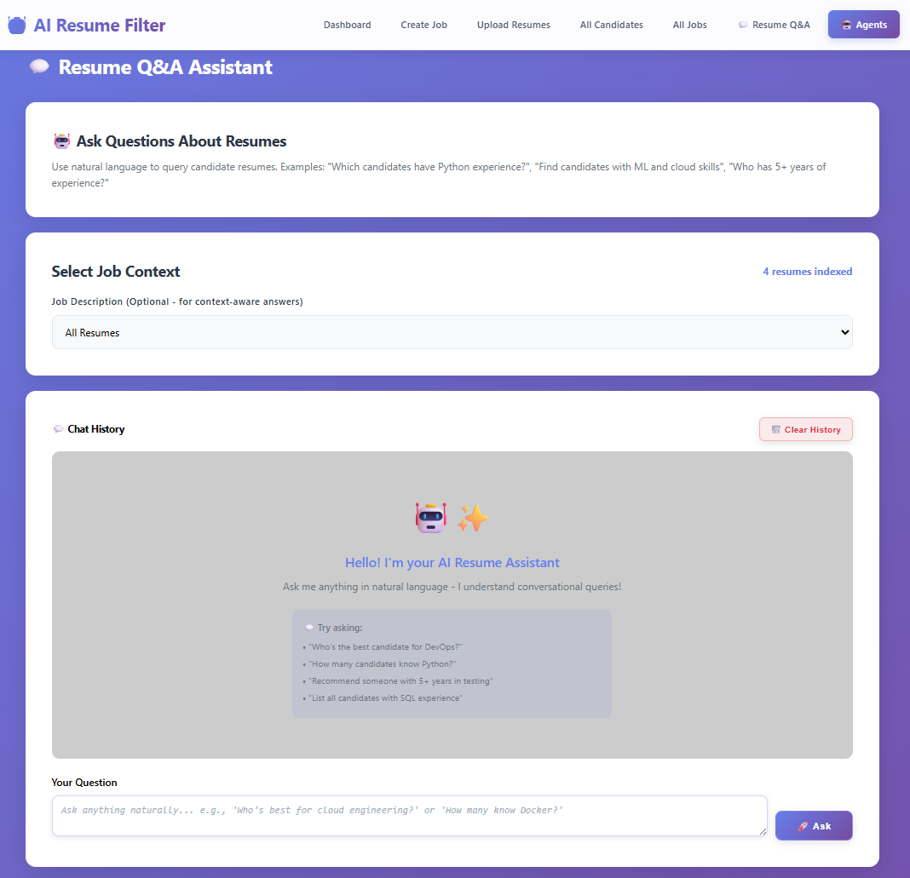
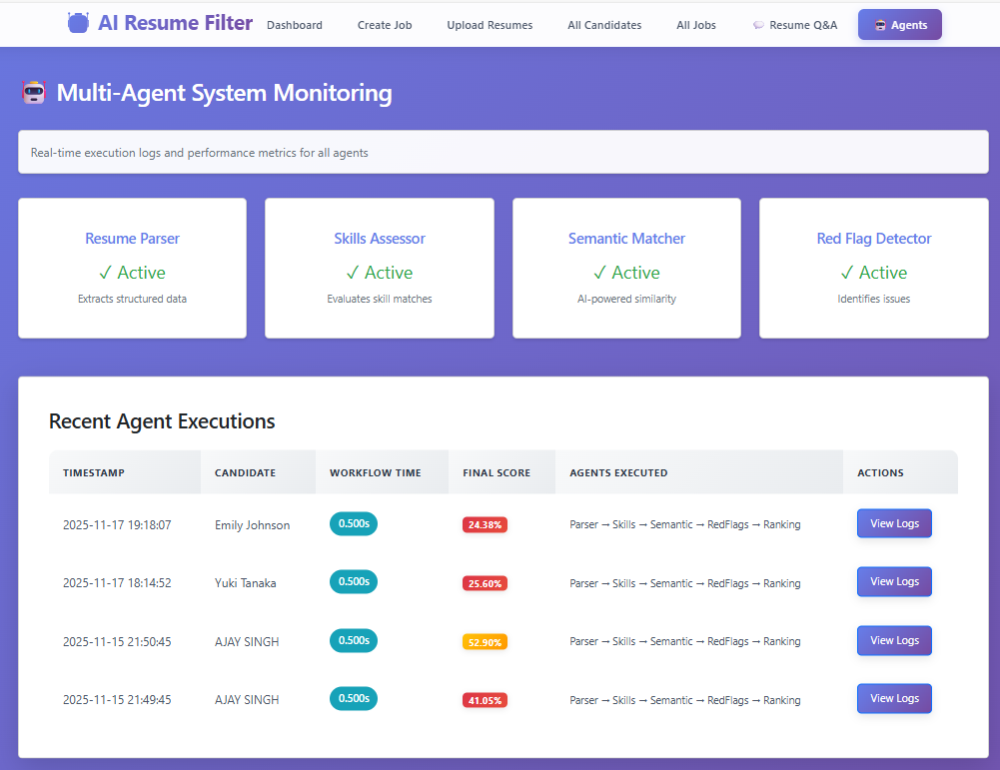
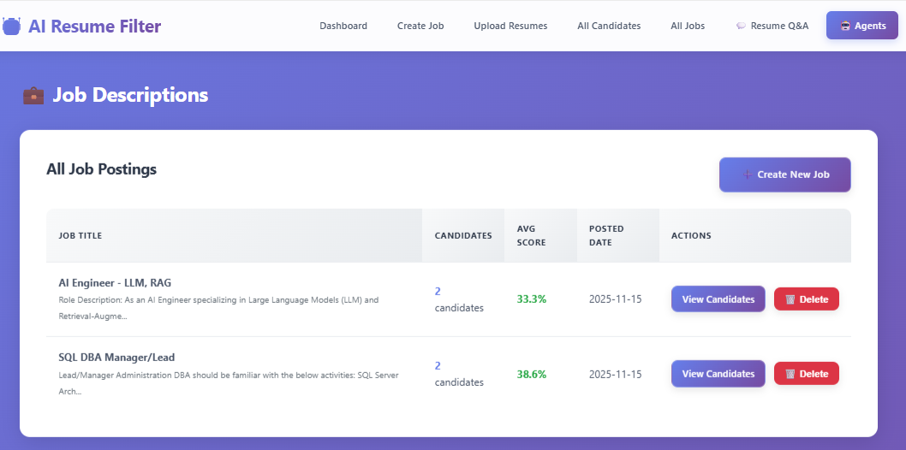

# AI Resume Filter — Multi-Agent Resume Screening

> A multi-agent resume screening platform that parses resumes, scores them against job descriptions using **transformer embeddings + hybrid keyword/fuzzy matching**, ranks and tiers candidates, and lets HR query the candidate pool in natural language via a built-in **RAG-style chatbot**.

[](https://www.python.org/)
[](https://flask.palletsprojects.com/)
[](https://www.mysql.com/)
[](https://www.sbert.net/)
[](#license)

---

## Why this exists

Recruiters spend hours skimming hundreds of resumes per opening. This system replaces the first-pass triage with a transparent, explainable scoring pipeline — and gives HR a chat interface to ask follow-up questions like *"show me senior Python candidates with LangChain experience"* without opening a single PDF.

Runs **fully offline** — no resumes leave your machine.

## Highlights

- 🤖 **5-agent pipeline** — Resume Parser, Skills Assessment, Semantic Matching, Red Flag Detection, Ranking Orchestrator
- 💬 **RAG-style chatbot** — natural-language candidate filtering with role-intent mapping (e.g. *"DevOps"* → Docker, Kubernetes, Jenkins, Terraform)
- 🧠 **Hybrid scoring** — Semantic 30% + Keywords 25% + Skills 30% + Experience 15%, weights tunable per role
- 🔢 **384-dim transformer embeddings** (`all-MiniLM-L6-v2`) + FuzzyWuzzy/Levenshtein (80% threshold)
- 🗂️ **Admin console** — manage 200+ skills, 70+ aliases, 12 role profiles without code changes
- 📥 **Dual-mode ingestion** — JD-targeted matching *and* JD-less bulk auto-profiling against role templates
- 📄 **PDF + DOCX** parsing via spaCy NER + PyPDF2 + python-docx
- 🔒 **Offline by design** — no external API calls; all inference local

## Screenshots

| Dashboard | Bulk Upload | Candidate Analysis |
|---|---|---|
|  |  |  |

| Chatbot | Agent Monitoring | All Jobs |
|---|---|---|
|  |  |  |

## Architecture

```
┌──────────────────────────┐    ┌─────────────────────────────────────┐
│  Flask UI + Chatbot      │───▶│  Ranking Orchestrator                │
│  (PDF/DOCX uploads)      │    │   ├─ Resume Parser Agent             │
└──────────────────────────┘    │   ├─ Skills Assessment Agent         │
                                │   ├─ Semantic Matching Agent (SBERT) │
                                │   └─ Red Flag Detection Agent        │
                                └────────────────┬────────────────────┘
                                                 │
                                ┌────────────────┴───────────────────┐
                                ▼                                    ▼
                       ┌────────────────┐                 ┌──────────────────┐
                       │  MySQL         │                 │  Skill catalog   │
                       │  (resumes,     │                 │  + role profiles │
                       │   scores, JDs) │                 │  (admin-managed) │
                       └────────────────┘                 └──────────────────┘
```

See [`MULTI_AGENT_ARCHITECTURE.md`](MULTI_AGENT_ARCHITECTURE.md) for full detail.

## RAG chatbot — supported query types

| # | Type | Example |
|---|---|---|
| 1 | Count | *"How many DevOps candidates do we have?"* |
| 2 | Comparison | *"Compare candidate A vs candidate B for the AI Lead role"* |
| 3 | Profile | *"Show me Ravi's full profile"* |
| 4 | Recommendation | *"Top 5 for the data engineer JD"* |
| 5 | Listing | *"List all candidates with Snowflake + dbt"* |
| 6 | Search | *"Anyone with FinTech background and Python?"* |
| 7 | Greetings | conversational |
| 8 | Help | feature discovery |

## Quickstart

### Prerequisites
- Python 3.8+
- MySQL 5.7+ (8.0 recommended)
- ~2 GB free RAM (transformer model)
- First-run internet access (downloads `all-MiniLM-L6-v2` and `en_core_web_sm`)

### Install
```powershell
git clone https://github.com/ajay-fitbit/AI-Resume-Filter.git
cd AI-Resume-Filter

python -m venv venv
.\venv\Scripts\Activate.ps1
python -m pip install --upgrade pip
pip install -r requirements.txt
python -m spacy download en_core_web_sm

Copy-Item .env.example .env
# Edit .env with your MySQL credentials
```

### Initialise the database
```powershell
Get-Content database_schema.sql        | mysql -u root -p
Get-Content database_admin_tables.sql  | mysql -u root -p
Get-Content insert_hardcoded_data.sql  | mysql -u root -p   # 200+ skills, 70+ aliases, 12 roles
```

### Run
```powershell
python app.py
# open http://localhost:5000
```

Full step-by-step setup is in [`QUICKSTART.md`](QUICKSTART.md).

## Configuration

| Var | Purpose | Example |
|---|---|---|
| `DB_HOST` | MySQL host | `localhost` |
| `DB_USER` | MySQL user | `root` |
| `DB_PASSWORD` | MySQL password | `***` |
| `DB_NAME` | Database name | `resume_filter_db` |
| `FLASK_SECRET_KEY` | Flask session secret | random string |
| `FLASK_ENV` | `development` / `production` | `development` |

## Built-in role profiles (12)

Full-Stack · DevOps · Data Scientist · Cloud Architect · AI/ML · BI · Backend · Frontend · Mobile · QA · Security · PM
(All editable via the admin console — no code change required.)

## Documentation

- [`QUICKSTART.md`](QUICKSTART.md) — setup walkthrough
- [`PROJECT_STRUCTURE.md`](PROJECT_STRUCTURE.md) — code layout
- [`ADMIN_SYSTEM_SUMMARY.md`](ADMIN_SYSTEM_SUMMARY.md) — admin console
- `MULTI_AGENT_ARCHITECTURE.md` — agent design (linked from header)
- `RAG_INTEGRATION_GUIDE.md` — vector-DB upgrade path

## Security & responsible use

- **Local-first** — embeddings, parsing, and matching run on-machine; no resume data sent to third parties
- **PII-aware** — admin should restrict UI access; contact details are not used as ranking signals
- **Bias-aware design** — scoring uses skills/experience only; demographic-correlated terms are not weighted
- **Explainable** — every score is broken down into the 4 sub-scores; chatbot answers cite which fields matched
- **No hard-coded credentials** — all via `.env` (gitignored)

## Roadmap

- [ ] Move to **Azure AI Search** for vector storage (current: SBERT + in-process)
- [ ] **PII redaction** (Azure AI Language / Presidio) before any LLM call
- [ ] **Bias regression suite** — name-swap stability test
- [ ] **LoRA-fine-tuned red-flag classifier** (DistilBERT)
- [ ] **MCP wrapper** — expose the agents as MCP tools so external assistants can drive the pipeline
- [ ] **Foundry deployment** — containerised on Azure Container Apps

## Related projects

- [`MCP`](https://github.com/ajay-fitbit/MCP) — Python MCP server for SQL Server (paired tooling for the planned MCP wrapper above)
- [`CLR-Project`](https://github.com/ajay-fitbit/CLR-Project) — SQL Server CLR helper

## Tech stack

`Python 3.8+` · `Flask 3.0` · `MySQL 8` · `Sentence-Transformers (all-MiniLM-L6-v2)` · `spaCy (en_core_web_sm)` · `PyPDF2` · `python-docx` · `FuzzyWuzzy + python-Levenshtein` · `scikit-learn` · `pandas`

## Author

**Ajay Singh** — Solutions Architect · agentic AI · MCP · LLM applications
[Portfolio](https://www.itshitechs.com/portfolio/) · [LinkedIn](https://www.linkedin.com/in/ajay-singh-ab40082/) · [GitHub](https://github.com/ajay-fitbit)

## License

MIT
